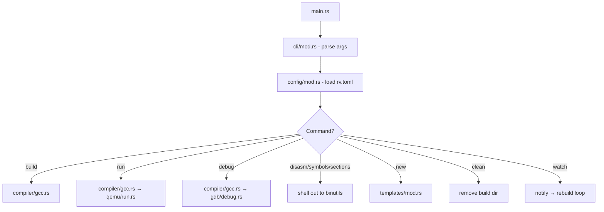

# Architecture

This document describes the internal design of rv for contributors and anyone curious about how it works.

## Overview

rv is a thin orchestration layer. It parses a config file, discovers source files, and shells out to GCC, QEMU, and GDB. It does not implement a compiler, assembler, or emulator.

```
CLI (clap)
    │
    ▼
Argument Parsing
    │
    ▼
Configuration Loader (rv.toml)
    │
    ▼
Command Dispatch
    │
    ├── Build Pipeline
    │       ├── Compile C sources
    │       ├── Assemble .S/.s/.asm sources
    │       └── Link ELF
    │
    ├── Run (QEMU)
    ├── Debug (QEMU + GDB)
    └── Inspect (objdump / nm / readelf)
```

## Project Layout

```
src/
├── main.rs              Entry point
├── cli/
│   └── mod.rs           Clap derive-based CLI definition
├── commands/
│   ├── mod.rs           Command dispatch
│   ├── new.rs           Project scaffolding
│   ├── build.rs         Compilation orchestration
│   ├── run.rs           QEMU execution
│   ├── debug.rs         GDB session management
│   ├── disasm.rs        Disassembly (objdump)
│   ├── symbols.rs       Symbol listing (nm)
│   ├── sections.rs      Section listing (readelf)
│   ├── clean.rs         Build artifact cleanup
│   └── watch.rs         File watcher + auto-rebuild
├── compiler/
│   └── gcc.rs           Compile and link via GCC
├── config/
│   └── mod.rs           rv.toml deserialization (serde + toml)
├── gdb/
│   └── debug.rs         QEMU stub + GDB orchestration
├── qemu/
│   └── run.rs           QEMU process management
└── templates/
    └── mod.rs           Scaffolding templates (rv.toml, starter .S, .gitignore)
```

## Control Flow



## Configuration System

`rv.toml` is deserialized into a `Config` struct using serde. All sections except `[project]` have defaults via `#[serde(default)]`, making the config progressively detailed.

Key design choice: toolchain paths, flags, and target settings are all user-configurable. rv never hardcodes target-specific behavior. A bare-metal RV32 project and a Linux RV64 project differ only in their `rv.toml`.

### Sections

| Section | Purpose |
|---------|---------|
| `[project]` | Project name (required) |
| `[target]` | ISA arch and ABI |
| `[sources]` | Override main file, list C sources |
| `[toolchain]` | Paths to GCC, objdump, nm, readelf, gdb |
| `[build]` | Optimization, flags, static linking |
| `[link]` | Link driver (ld/cc), libraries, linker script |
| `[compile]` | Debug symbols |
| `[output]` | Build directory, binary name |
| `[qemu]` | Mode (user/system), binary path, extra args |

## Build Pipeline

The compiler module (`compiler/gcc.rs`) handles the full build:

1. **Discover sources** — walk `src/` for `.S`, `.s`, `.asm` files; read `c_files` from config
2. **Compile each source** — dispatch to `compile_c` or `compile_asm` based on extension
3. **Link** — invoke GCC (or ld) with all object files to produce an ELF

Object files are named `{filename}.{ext}.o` (e.g., `main.S.o`, `helper.c.o`) to avoid collisions.

### Link Drivers

| Driver | Invocation | Use case |
|--------|-----------|----------|
| `ld` | `gcc -nostdlib` | Bare metal, user provides `_start` |
| `cc` | `gcc` (normal) | User-mode with libc, links crt/libc/libgcc |

## Target Abstraction

rv does not have a target registry or enum. Instead, the target is fully described by `rv.toml` fields:

- `target.arch` / `target.abi` → passed as `-march` / `-mabi` to GCC
- `toolchain.*` → which binaries to invoke
- `link.driver` / `link.script` → how to link
- `qemu.*` → how to execute

This means adding support for a new RISC-V target (e.g., RV32 embedded, ESP32-C6) requires zero code changes. Users just write a different config.

## Toolchain Abstraction

Currently, rv supports GCC exclusively. The tool names and flag conventions are GCC-specific. Future work may abstract this behind a trait if LLVM/Clang support is added, but premature abstraction is avoided.

## Design Philosophy

- **Configuration over code** — behavior changes through `rv.toml`, not source patches
- **Shell out, don't reimplement** — GCC, QEMU, and GDB are mature tools; rv orchestrates them
- **Progressive complexity** — minimal config works; advanced features are opt-in
- **No magic** — `--verbose` shows exactly what rv runs; users can replicate it manually
- **Single responsibility** — each module does one thing

## Extending rv

### Adding a command

1. Add a variant to `cli/mod.rs::Command`
2. Create `src/commands/<name>.rs`
3. Export from `commands/mod.rs`
4. Wire it into `Cli::run()` match

### Adding a config field

1. Add the field to the appropriate struct in `config/mod.rs` with `#[serde(default)]`
2. Use it in the relevant command module

### Supporting a new tool (e.g., LLVM objdump)

The toolchain paths in `rv.toml` already allow users to point at any compatible binary. If the flags differ significantly, a new toolchain backend may be needed.
